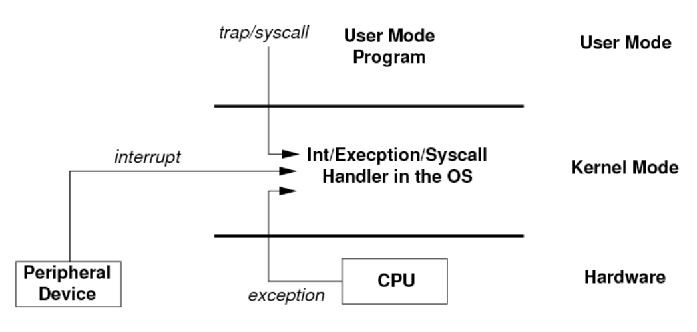
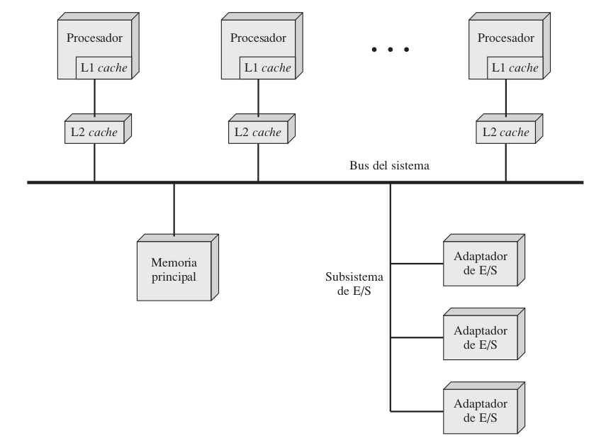
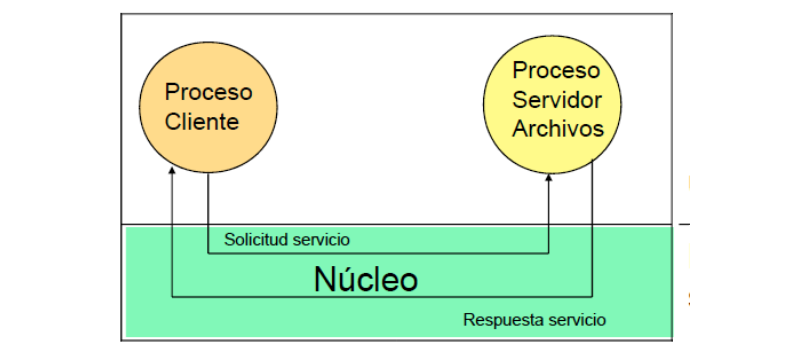
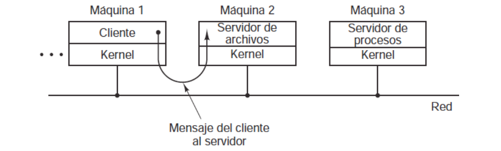

# Tema 1. Estructuras de Sistemas Operativos

---

## Tabla de contenidos

[TOC]

---

## 1. Introducción

Un **sistema operativo** es un programa que controla la ejecución de aplicaciones y programas y que actúa como interfaz entre las aplicaciones y el hardware del computador. Se puede considerar que tiene los siguientes tres objetivos:

* **Conveniencia** (interfaz usuario-ordenador): presenta al usuario una máquina abstracta más fácil de programar, ocultando la complejidad del hardware y facilitando
  el acceso a utilidades, servicios y procesos. Para un usuario final (generalmente no
  programador) estos detalles tan complicados no son útiles y para un usuario
  programador, un lenguaje de alto nivel resulta más útil que un conjunto de
  enrevesadas instrucciones máquina. El SO proporciona servicios en las siguientes
  áreas:

  * Desarrollo de programas (editores, compiladores, depuradores...).
  * Ejecución de programas (carga, inicializa y repara los recursos de estos).
  * Acceso a dispositivos E/S (cada dispositivo requiere su propio conjunto de
    instrucciones que se ocultan al usuario).
  * Acceso controlado a ficheros.
  * Acceso al sistema (controla el acceso y uso de los recursos del sistema a
    diferentes usuarios).
  * Detección y respuesta a errores (hardware y software).
  * Contabilidad (estadísticas de uso y medida del tiempo de respuesta del sistema).

* **Eficiencia** (administrador de recursos): Un computador es un conjunto de procesos
  para el movimiento, almacenamiento y procesamiento de datos, y para ello posee un
  mecanismo de control que cubre estos dos aspectos:

  * Las funciones del SO actúan de la misma manera que el resto del software
    (programa ejecutados por el procesador).
  * El SO frecuentemente cede el control al procesador y depende del mismo para
    retomarlo.

  Por lo tanto:

  * El SO dirige al procesador en el uso de los recursos del sistema y en la
    temporización de la ejecución de otros programas.
  * Una parte del SO está cargada en memoria principal (kernel/núcleo y, a veces,
    otras partes del mismo que se estén usando). El resto de la memoria la ocupan
    programas y datos de usuario.
  * La asignación de memoria principal la gestionan conjuntamente el SO y el
    hardware de gestión de memoria.
  * El SO gestiona el uso de dispositivos E/S y el acceso a ficheros.

- **Habilidad de evolucionar.** Razones para hacerlo:
  - Actualizaciones del hardware actual y nuevos tipos de hardware.
  - Mejorar y/o aportar nuevos servicios.
  - Resolución de fallos de un SO a lo largo del tiempo de uso.

### 1.1. Evolución de los SOs

#### Procesamiento serial

Con los primeros ordenadores (1940-1950) los programadores interactuaban
directamente con el hardware mediante luces, interruptores, algún dispositivo de
entrada (ej: lector de cartas) y una impresora. No había SO.

* Problemas: planificación de recursos y un inmenso período de tiempo en
  organización y configuración.
* Solución: inclusión de herramientas software como bibliotecas, depuradores y
  rutinas E/S.

#### Sistemas monoprogramados

A partir de mediados de los 50 se introducen SO simples con rutinas y subrutinas
cargadas en memoria principal. Los primeros sistemas monoprogramados consistían en
en **cargar uno por uno los procesos en memoria**, es decir, se cargaba el primero y,
cuando había acabado, o bien de forma normal o bien por error, se cargaba el siguiente
proceso, y así sucesivamente.

* Problemas: _los resultados eran un caos, no se aprovechaba la CPU, el uso de
  memoria ni el uso de dispositivos de E/S, grandes tiempos de espera..._

#### Sistemas multiprogramados

Los sistemas monoprogramados aún no eran suficiente, ya que eran muy lentos e
ineficientes, ya que el procesador quedaba bloqueado o inactivo durante, por ejemplo,
operaciones E/S.

Se introdujo entonces el concepto de multiprogramación, el cual consiste en que **varios
procesos residen en memoria principal** y se ejecutan solapándose entre sí a tal
velocidad que **se están ejecutando simultáneamente** (en realidad se ejecutan
consecuentemente). Esto reducía los tiempos de espera enormemente ya que mientras
un proceso esperaba a alguna operación E/S, otros procesos podían estar
ejecutándose.

Este sistema, que era mucho más sofisticado, requería contar con un mecanismo de
interrupciones y un gestor de memoria, además de algoritmos de selección de CPU.

#### Sistemas de tiempo compartido

Cuando los **procesos**, aparte de estar situados **en memoria al mismo tiempo** y estar
ejecutándose consecuentemente, pueden ser o son **interactivos**, nos encontramos
frente a la técnica que se conoce como tiempo compartido.

Esta técnica permite que el SO pueda expulsar al proceso actual una vez acabado su
tiempo arbitrario (quantum) para dar paso a otros.

Permite que un gran número de usuarios interactúen y ejecuten diversos programas de
manera simultánea. También necesita una serie de requisitos.

### 1.2 Características de un SO

* **Corrección.** Habilidad de corregir errores detectados durante la ejecución.
  * Debe contener la sincronización adecuada requerida por los procesos en cuestión
    (programas concurrentes). ¿Qué eventos pueden provocar que varias partes del
    SO se ejecuten simultáneamente?
    * **Interrupción:** es una señal recibida por el procesador para indicarle que debe
      interrumpir el curso actual de ejecución y pasar a ejecutar código específico para
      tratar esa situación. Tras la ejecución de dicho bloque de instrucciones se
      restablece la ejecución casual. Se tratan de señales asíncronas y existen dos
      tipos:
      * Interrupción hardware: _son externas a la CPU y por lo general vienen de
        dispositivos E/S._
      * Interrupción software: _son generadas por un programa en ejecución. También
        reciben el nombre de llamadas al sistema._
    * **Excepción:** se trata de una señal síncrona típicamente causada por un error en
      un programa. Genera un cambio de contexto (usuario —> supervisor) para que el
      SO atienda el error. Se trata de mecanismos de protección.
  * Distintas partes del SO pueden estar implementadas como procesos
    concurrentes.
    * Ser capaz de detectar todo tipo de errores.
    * Ser capaz de funcionar correctamente ante una caída del flujo eléctrico
      (conjunto de instrucciones que deben ejecutarse “Todo o nada”).
* **Tolerancia a fallos.** No todos los errores que surjan pueden ser tratados por igual ni
  generar las mismas consecuencia para el sistema.
* **Extensible.** Debido a los nuevos y rápidos cambios que se producen en hardware y
  software gracias a los avances tecnológicos, un SO debe poder incluir, añadir,
  modificar o eliminar componentes a un coste mínimo y de forma sencilla.
* **Reentrancia.** Capacidad de que pueda haber varias instancias de ejecución.
* **Fiabilidad.** El SO debe ser robusto, es decir, debe responder de forma predecible a
  circunstancias de error y protegerse activamente a sí mismo y los usuarios de
  acciones accidentales y malintencionadas.
* **Extensibilidad.**

Conseguir las propiedades anteriores es particularmente difícil en un SO debido a su carácter de **sistema concurrente**. Eventos que provocan concurrencia en un SO son:

* llamadas al sistema.
* interrupciones.
* excepciones.
* partes del SO que se ejecutan como programas concurrentes.

### 1.3 Servicios / Componentes del SO

#### Gestor de procesos

Un proceso es una instancia de un programa en ejecución con un estado actual y una
serie de recursos asignados. El SO es responsable, entre otros, de las actividades
relacionadas a procesos:

- Creación / Destrucción
- Suspender / Reanudar
- Sincronización / Comunicación
- Controlar hebras

#### Gestor de memoria principal

La memoria principal es el almacenamiento de acceso directo para los procesos y los
dispositivos de E/S. Esta memoria es volátil. Es responsable, entre otras, de:

- Asignar / desasignar memoria a los programas.
- Mantener la pista de la memoria utilizada actualmente y quién la usa.
- Decidir cuánta memoria asignar a cada proceso y cuándo debe ser retirado de
  memoria.
- Transformación direcciones virtuales <—> direcciones reales.
- Sistemas de paginación / segmentación.

#### Gestor de archivos

Un archivo es una colección de información con nombre y la entidad básica de
almacenamiento persistente. El sistema de almacenamiento suministra:

- Primitivas para manipular archivos y directorios, crear, borrar, leer, escribir...
- Correspondencia entre archivos y un almacenamiento secundario.
- Otros servicios generales (ej: backup).

#### Gestor de E/S

Los SOs ofrecen a los programas un interfaz estándar de los dispositivos, es decir,
utilizan las mismas funciones independientemente del dispositivo al que acceden.
Un controlador de dispositivo gestiona un tipo de dispositivo: inicialización,
interrupciones, lectura/escritura...

#### Sistema de protección

Referencia al mecanismo para controlar los accesos de los programas a los recursos
del sistema. Es un mecanismo general a todo el SO, es decir, no está localizado en un
único módulo.
Este mecanismo debe:

- Distinguir entre uso autorizado y no autorizado.
- Especificar qué control se debe suponer.
- Suministrar los medios para su aplicación.

#### Gestor de recursos

Debe repartir los recursos entre los procesos según estos tres principios:
- Equidad.
- Grado de importancia y requisitos.
- Eficiencia.

## 2. Sistemas Operativos de propósito específico

### Sistemas Operativos de tiempo real

Suelen utilizarse en aplicaciones especializadas y si el objetivo es **garantizar que las
respuestas se produzcan en un período de tiempo** (t) **especificado** (deadlines). Hay
dos tipos:

* **SO de tiempo real estricto (_Hard Real Time_)**: es absolutamente imperativo que las respuestas se produzcan en el tiempo especificado.
* **SO de tiempo real no estricto (_Soft Real Time_)**: los tiempos de respuesta son importantes pero el sistema seguirá funcionando correctamente aunque los tiempos límite no se cumplan ocasionalmente.

Con el uso de aplicaciones multimedia sobre PCs, todos los SOs actuales tiene
requisitos en tiempo real.

* Problema: *un SO de este tipo debe poder ejecutar (planificar) todas las*
  *actividades del sistema con el fin de satisfacer todos los requisitos críticos de las*
  *mismas, incluidos los temporales.*

### Sistema Operativo en red - Sistema Operativo distribuido

_**Sistema informático distribuido:** conjunto de ordenadores sin memoria ni reloj común interconectados a través de un sistema de comunicación que podría permitir que estén geográficamente dispersos._

Este sistema de comunicación constituye la única posibilidad de comunicar información.

La comunicación se realiza mediante operaciones de enviar/recibir mensajes, siendo la duración del envío de un mensaje grande respecto al tiempo de ejecución de una instrucción máquina.

Un sistema distribuido tiene como objetivo compartir recursos o permitir la dispersión geográfica.

#### Sistema Operativo en red

_Cada computador tiene su propio sistema operativo; el SO en red es un añadido al sistema operativo local añadiendo posibilidades de comunicación._

Se necesita software de bajo nivel para las E/S en la red, pero ello no cambia esencialmente la estructura del SO.

El usuario conoce la existencia de múltiples computadores y debe trabajar con ellos de forma explícita: el usuario conoce dónde se ubican los archivos y dónde se ejecutan los procesos.

#### Sistema Operativo distribuido

_Es un SO común compartido por una red de computadoras._

A los usuarios les parece un sistema operativo tradicional con una sola máquina, pero les proporciona acceso transparente a los recursos de diversas máquinas: el usuario no conoce dónde se ubican los archivos ni dónde se ejecutan los procesos.

Característica: transparencia.

#### Sistemas Operativos paralelos

Exclusivos para sistemas multiprocesadores, es decir, sistemas de computador con
**varios procesadores que comparten una única memoria y reloj**.

Estos sistemas sustentan aplicaciones paralelas cuyo objetivo es aumentar la velocidad
de tareas computacionalmente complejas (mejorar la eficiencia).

Actualmente implementa **multiprocesamiento simétrico (SMP)** que consiste en que
todos los procesadores pueden ejecutar tanto código del SO como de las aplicaciones,
sin importar localización en memoria. Estos sistema pueden mover fácilmente tareas
entre los procesadores para garantizar eficientemente el trabajo.

* Problema: *Para comunicarse con memoria, los procesadores comparten un bus,*
  *que debe ser arbitrado para que solo un procesador lo use en cada instante de*
  *tiempo. Esto conlleva largas esperas a que lleguen los datos de memoria.*

_Proporciona primitivas básicas para dividir una tarea en múltiples actividades paralelas, así como una comunicación y sincronización eficiente entre esas actividades._

## 3. Estructura de un Sistema Operativo

### 3.1 Sistemas monolíticos

_Todo el SO se ejecuta como un único ejecutable en modo kernel._

El SO se escribe como una colección de procedimientos enlazados entre sí en un único programa binario ejecutable extenso.

Cada procedimiento del sistema tiene la libertad de llamar a cualquier otro.

Todos los elementos comparten el mismo espacio de direcciones. No hay ocultamiento de la información.

###### Características

* Poco fiable: un error en una parte puede provocar caída en el sistema.
* Poco manejable, difícil de comprender y mantener.
* Poca tolerancia a fallos.
* Poca extensibilidad.

### 3.2 Estructura de capas

*El sistema operativo se dispone como una serie de capas constituidas una encima de otra de forma jerárquica.* Cada una es una máquina más abstracta para la capa superior, con lo que permite una ocultación “capa a capa”.

Por modularidad, las capas se seleccionan para que cada una utilice solo funciones de las capas inferiores. A la hora de depuración y construcción, esta estructura presenta una clara ventaja, ya que cada capa se construye y se depura y, mientras que haya errores, no se empieza con la capa siguiente.

Existe sobrecarga de comunicaciones entre las distintas capas.

###### Problemas

- Requiere una planificación muy cuidadosa, ya que es muy difícil organizar
  correctamente las capas.
- A menudo, los sistemas se modelan con esta estructura pero se construyen de otra
  manera.
- Sobrecarga de comunicaciones entre las capas.
- Menor eficiencia que otras implementaciones debido a que pasar de una capa a otra
  supone una carga de trabajo adicional.

### 3.3 Estructura cliente-servidor o estructura microkernel

> **Núcleo**: parte del SO que incluye las porciones de software utilizadas más frecuentemente, tiene estas características:
>
> * Generalmente, el núcleo se mantiene permanentemente en memoria principal.
> * Se ejecuta en modo privilegiado.
> * Frecuentemente se ejecuta con interrupciones inhibidas, o con un alto nivel de inhibición de interrupciones.
>
> Responde a llamadas al sistema realizadas por los procesos e interrupciones de dispositivos. Ha de estar altamente depurado, no puede contener errores.

Idea central de la estructura cliente-servidor: _reducir al mínimo la funcionalidad del núcleo e implementar las restantes partes del SO como procesos._

Para solicitar un servicio, el proceso de usuario (cliente) envía un mensaje al proceso servidor, que realiza el servicio y devuelve al cliente una respuesta.

Para implementar un microkernel, se estructura el SO eliminando todos los componentes no esenciales del kernel y se implementan como programas de usuario.

El microkernel sólo debe contener información básica para crear y comunicar procesos. Esto último es clave. Debe proporcionar un mecanismo de comunicación entre procesos cliente y procesos servidor. La aplicación envía el mensaje de una solicitud (send) y permanece esperando la respuesta (receive). El kernel verifica este mensaje y lo manda al servidor. Por último, el servidor que está en espera realiza el servicio solicitado y devuelve el resultado.

Un proceso servidor es aquel que resuelve una cola de peticiones:

​	Toma petición
​	Resuelve petición
​	Informa resultados

###### Ventajas

* Mayor tolerencia a fallos y extensibilidad.
* Adaptable a sistemas distribuidos (ver figura siguiente).
* Mayor fiabilidad y seguridad, un posible error en el SO queda confinado en el espacio de direcciones del proceso que lo implementa.

###### Inconvenientes

* Peor rendimiento que las estructuras anteriores: para resolver un servicio se realizan más cambios de contexto entre procesos y se desencadenan más ejecuciones de otros servicios como paso de mensajes.
* Carga de procesamiento adicional por funciones del sistema.

A continuación, el modelo cliente-servidor sobre una red.

### _Microkernel vs. monolítica_

- La estructura microkernel es más flexible que la monolítica.
- La estructura microkernel tiene peor rendimiento que la monolítica:

|                              | Monolítica | Microkernel |
| ---------------------------- | ---------- | ----------- |
| Nº cambios de nodo           | 2          | 4           |
| Nº cambios de proceso - SO   | 2          | 4           |
| Nº cambios proceso - proceso | 0          | 2           |

