# Tema 2. Procesos e hilos

\> _**Nota:** a menos que se especifique lo contrario, nos encontramos en entorno monoprocesador._

## 1. Generalidades sobre procesos e hilos

### 1.1 Ejecución del SO dentro de los procesos de usuario

El SO se percibe como un conjunto de rutinas que un proceso de usuario invoca para realizar una determinada función, siendo así que el software del SO se ejecuta en el contexto del proceso de usuario.

Un proceso se ejecuta en **modo privilegiado** cuando se ejecuta código del SO.

Se usa una **pila de núcleo** para cada proceso, para manejar llamadas/retornos al/del modo núcleo. El código del SO y sus datos están en el espacio de direcciones compartidas y se comparten entre todos los procesos.

A continuación, imagen del proceso: el sistema operativo ejecuta dentro del espacio de usuario.

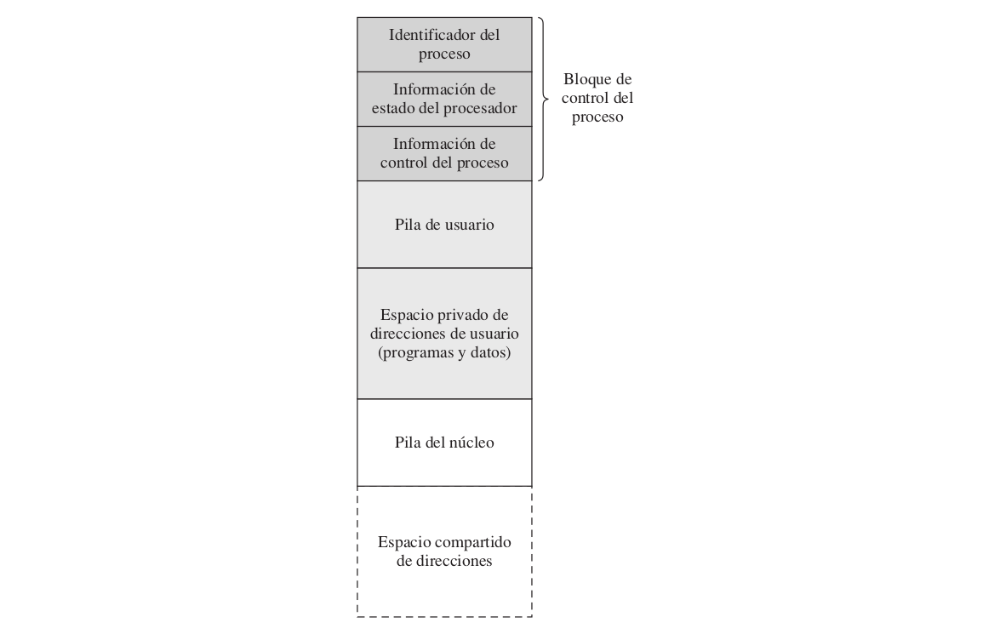

Cuando ocurre una **llamada al sistema** el procesador se pone en modo núcleo y el control se pasa al SO (la ejecución continúa dentro del proceso de usuario actual). De esta forma, no se realiza un cambio de proceso, sino un cambio de modo dentro del mismo proceso.

El SO, tras realizar su trabajo:

* si determina que el proceso actual debe continuar con su ejecución, se realiza un cambio de modo y prosigue el proceso interrumpido.
* en caso contrario, se pasa el control a la rutina de cambio de proceso.

### 1.2 Sobre la creación de procesos

Crear un proceso conlleva, a grandes rasgos:

* asignarle el espacio de direcciones que utilizará.
* crear las estructuras de datos para su administración.

Los sucesos comunes que provocan la creación de un proceso son:

* en sistemas bach: el planificador a largo plazo selecciona uno de los trabajos por lotes en espera para crear el proceso correspondiente.
* en sistemas interactivos: cuando el usuario se conecta, el SO crea un proceso que ejecuta un intérprete de órdenes (o bien el programa ejecutable asociado al perfil de usuario).
* el SO puede crear un proceso para llevar a cabo un servicio solicitado por un proceso de usuario.
* un proceso puede crear otro mediante la llamada al sistema correspondiente.

### 1.3 Cambio de contexto

Cuando un proceso se está ejecutando su PC (_Program Counter_), puntero a pila (SP, _Stack Pointer_), registros, etc. están cargados en la CPU.

Cuando el SO detiene a un proceso en ejecución, salva los valores actuales de esos registros (**contexto**) al PCB (_Process Control Block_) de ese proceso.

_La acción de conmutar la CPU de un proceso a otro se denomina **cambio de contexto**._

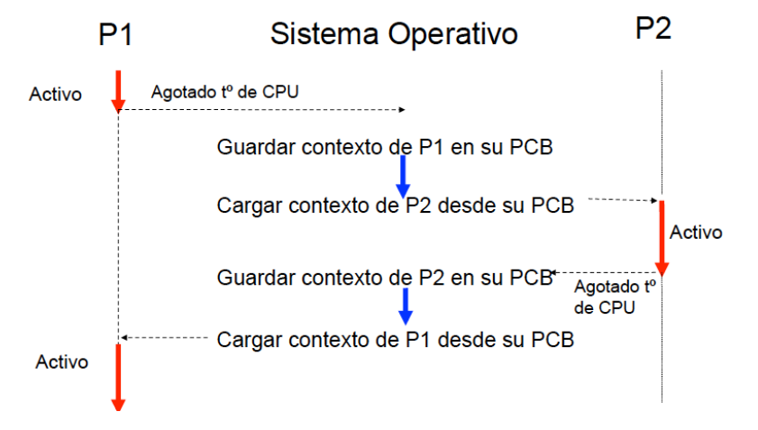

### 1.4 PCBs y colas de estados

_El SO mantiene una **colección de colas** que representan el estado de los procesos que hay en sistema._

Típicamente hay una cola por estado.

Cada PCB está encolado en una cola de estado de acorde a su estado actual.

Conforme un proceso cambia de estado, su PCB es retirado de una cola y encolado en otra.

#### Colas de estados

* **Cola de trabajos:** conjunto de trabajos pendientes de ser admitidos en el sistema (trabajos por lotes).
* **Cola de preparados:** conjunto de todos los procesos que residen en memoria principal, preparados y esperando para ejecutarse (estado _preparado_ o _ejecutable_).
* **Cola/s de bloqueados:** conjunto de procesos esperando un evento o un recurso actualmente no disponible (estado _bloqueado_).

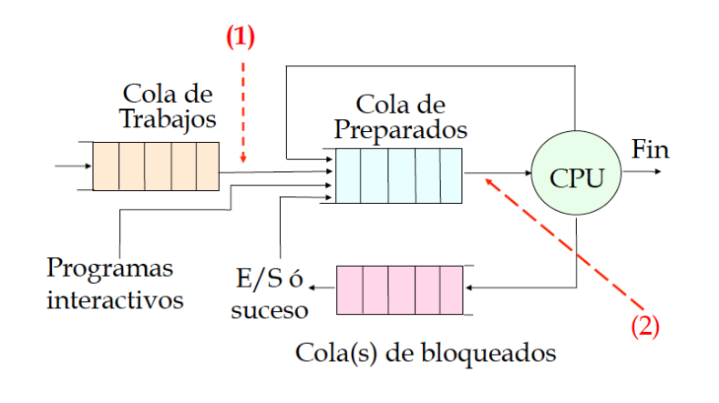

### 1.5 Planificación de procesos

_**Planificador:** parte del SO que controla la utilización de un recurso._

#### Tipos de planificadores de la CPU

* **Planificador a largo plazo (o planificador de trabajos):** selecciona los trabajos que deben admitirse en el sistema (transición 1 en la figura anterior).
* **Planificador a corto plazo (o planificador de la CPU):** selecciona al proceso en estado *preparado* o *ejecutable* que debe ejecutarse a continuación y le asigna la CPU (transición 2 en la figura anterior). Es invocado muy frecuentemente.
* **Planificador a medio:** se encarga de sacar/introducir procesos de/a MP (transición 3 en la figura siguiente).

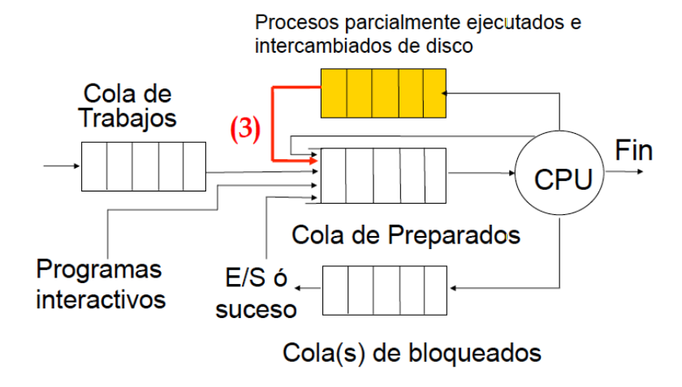

#### Comportamiento de un proceso: ráfagas de CPU y de bloqueo

Normalmente un proceso alterna ráfagas de CPU con períodos de tiempo en que se encuentra en estado _bloqueado_.

La ejecución de un proceso comienza con una ráfaga CPU.

Puede que realice una operación que le provoque pasar a estado *bloqueado* (por ejemplo realizar una petición de E/S). En algún momento pasa a estado *ejecutable* (por ejemplo debido al fin de la E/S) y llegará a ser elegido para estar *en ejecución*. Finalmente, el proceso concluye con una solicitud al SO para finalizar la ejecución.

* _**Ráfaga de CPU:** periodo de tiempo en que el proceso está en estado_ ejecutándose_, haciendo uso de la CPU._
* _**Ráfaga de bloqueo:** periodo de tiempo en que el proceso está en estado_ bloqueado_._

En la figura siguiente se ejemplifica esta alternancia particularizándose al caso de la realización de E/S como causa de bloqueo.

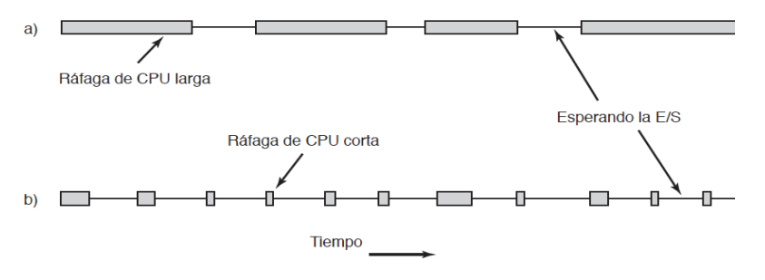

#### Procesos limitados por E/S - procesos limitados por CPU

* _**Proceso limitado por E/S:** dícese del proceso que intercala pequeñas ráfagas de tiempo de CPU con largos periodos de espera, es decir, frecuentemente realiza alguna operación que provoca que su estado cambie a bloqueado (por ejemplo E/S)._
  * Ráfagas de CPU cortas.
* _**Proceso limitado por CPU:** dícese del proceso que realiza cómputos durante largos periodos de tiempo sin realizar ninguna petición que le cambie a estado bloqueado._
  * Ráfagas de CPU largas.

#### Mezcla de trabajos

Es importante que el planificador a largo plazo seleccione una buena mezcla de trabajos, ya que:

* si un alto número de procesos fuesen limitados por E/S, la cola de _preparados_ estaría casi siempre vacía y la CPU estaría infrautilizada.
* si un alto número de procesos fuesen limitados por la CPU, los dispositivos de E/S (u otros recursos) estarían infrautilizados.

#### Sobre los términos "despachador" - "planificador a corto plazo"

Algunos autores diferencian estos términos del siguiente modo:

* _**Planificador a corto plazo:** parte del SO que decide a qué proceso darle el control de la CPU._
* _**Despachador:** parte del SO que realiza las acciones adecuadas para efectuar el cambio de asignación de CPU entre dos procesos, tal como lo haya decidido el planificador a corto plazo. Esto involucra:_
  * _salvar el contexto del proceso actual y restaurar el contexto del nuevo proceso._
  * _salto a la posición de memoria del nuevo proceso para su reanudación._

En la asignatura utilizaremos ambos términos como equivalentes, refiriéndonos a la _parte del SO que realiza todas las acciones involucradas en la asignación de CPU a un nuevo proceso._

#### Activación del planificador a corto plazo

El planificador a corto plazo debería activarse cuando...

1. El proceso actual finaliza o ejecuta una operación que lo bloquea.
2. Un elemento del SO determina que el proceso actual no puede seguir ejecutándose pasándolo a estado _bloqueado_ (ej: retiro de MP).
3. Un evento ajeno al proceso actual hace que el SO determine que el proceso actual no es el más preferente para disfrutar de la CPU (por ejemplo, el proceso agota el _quantum_ de tiempo asignado, cambiando de estado _ejecutándose_ a _ejecutable_).

Se dice que la política de planificación es **apropiativa (_preemptive_)** si se incluyen los casos 2 o 3 de la lista anterior.

###### Caso particular

La llegada de un nuevo proceso ejecutable activa al planificador a corto plazo para decidir a qué proceso asignar la CPU. La aparición del nuevo ejecutable puede haberse debido a:

* cierto suceso ha cambiado el estado de un proceso (distinto al actual) de _bloqueado_ a _ejecutable_.
* se ha creado un nuevo proceso.

En este caso se habla de **política de planificación con derecho preferente** o **con desplazamiento**.

#### Sobre el comportamiento de las políticas de planificación de la CPU

Para reflexionar sobre el comportamiento de las políticas de planificación se definen ciertas medidas asociadas a cada proceso (denotamos por ___t___ el tiempo de CPU del proceso):

* **Tiempo de respuesta o de finalización (___T___):** tiempo total transcurrido desde que se crea el proceso hasta que termina.

* **Tiempo de espera (_E_):** tiempo que el proceso ha estado esperando en la cola de ejecutables.
  $$
  E=T-t
  $$

* **Penalización (P):** proporción de tiempo empleado por el SO en tomar decisiones alusivas a planificación de procesos y haciendo los cambios de contexto necesarios. En un sistema eficiente debe representar entre el 10% y el 30% del total de tiempo de la CPU.
  $$
  P=\frac{T}{t}
  $$

###### Objetivos que deben cumplirse

* Buen uso del recurso (la CPU): una proporción alta de tiempo se emplea para ejecución de procesos, una proporción baja de tiempo se emplea para ejecución del SO.
* Buen servicio (una baja penalización a los procesos).

En un entorno interactivo será prioritario asegurar una respuesta ágil del sistema frente a una buena utilización de la CPU. En un entorno no interactivo se primará el aprovechamiento de la CPU.

#### 1.5.1 Algoritmo de planificación FCFS (_First Come First Served_) o FIFO

_Los procesos son servidos según el orden de llegada a la cola de ejecutables._

* Algoritmo no apropiativo: cada proceso se ejecutará hasta que finalice o se bloquee.
* Fácil de implementar pero pobre en cuanto a prestaciones.
* Todos los procesos pierden la misma cantidad de tiempo esperando en la cola de ejecutables: el tiempo de espera es independiente del tiempo de CPU de la ráfaga. Al aumentar el tiempo de CPU de la ráfaga la penalización ___P___ disminuye.

Descartado para entornos interactivos debido a que:

* un proceso se adueña de la CPU.
* las ráfagas cortas quedan muy penalizadas (es importante garantizar un buen tratamiento a los procesos interactivos, y es característico de los procesos interactivos que tengan ráfagas cortas).

###### Ejemplo

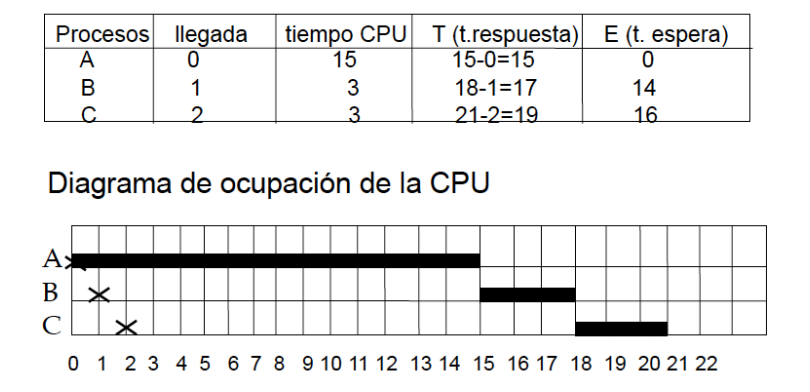

#### 1.5.2 Algoritmo de planificación SJF (_Shortest Job First_)

_Cuando el procesador queda libre, selecciona el proceso tenga la siguiente ráfaga de CPU más corta. Si existen dos o más procesos en igualdad de condiciones, se sigue FCFS._

Necesita conocer explícitamente el tiempo estimado de ejecución _¿Cómo?_ Es necesaria una estimación.

* Algoritmo no apropriativo.
* Tiempo medio de espera bajo.
* Tiene solo utilidad teórica, ya que es necesario conocer el tiempo de CPU que durará una ráfaga antes de que sea ejecutada.

###### Ejemplo

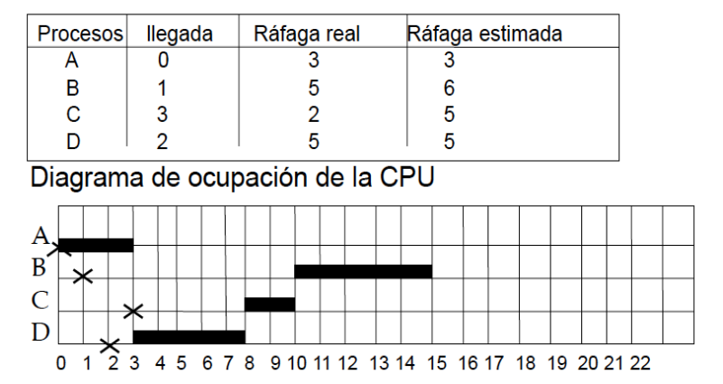

#### 1.5.3 Algoritmo de planificación SJF con desplazamiento o SRTF (_Shortest Remaining Time First_)

_Cuando un proceso llega a la cola de ejecutables se comprueba si su tiempo de CPU es menor que el tiempo que le queda al proceso que está ejecutándose; casos:_

* _si es menor: se realiza un cambio de contexto y se asigna la CPU al proceso que acaba de llegar._
* _en caso contrario: continúa el proceso que estaba ejecutándose._

Suponiendo que se dispone de un método de estimación adecuado, tenemos:

* Ráfagas cortas muy bien tratadas.
* Ráfagas largas muy mal tratadas.
* Respecto al conjunto de algoritmos, es el que proporciona la menor penalización promedio.

###### Ejemplo

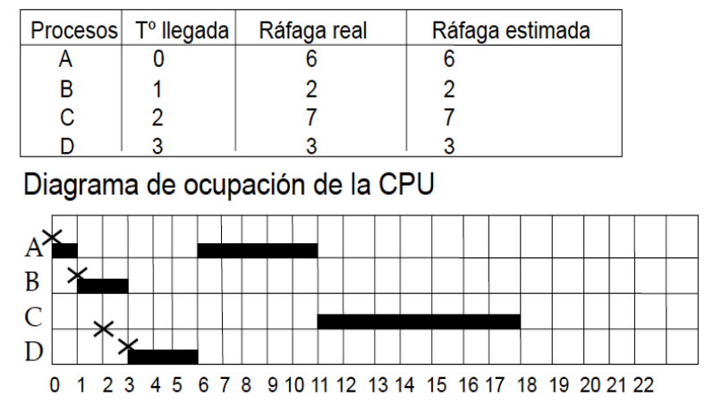

#### 1.5.4 Planificación por turnos, "barrido cíclico" o RR (_Round Robin_)

\> _Si no se especifica otra cosa, entendemos que aplicamos los algoritmos sin desplazamiento._

La cola de ejecutables se ordena por orden cronológico de llegada. Se elige el proceso más antiguo, disfrutará de la CPU durante un máximo de tiempo que llamamos _quantum_.

Si el proceso finaliza o se bloquea antes de agotar el quantum, libera a la CPU y se toma el siguiente proceso de la cola de ejecutables. En caso contrario, se le retira el control de la CPU y se coloca al final de la cola de ejecutables.

###### Ejemplo

\> _Repetir con quantum=1._

Si un proceso X llega a la cola de ejecutables al mismo tiempo que el actual Y agota su quantum (y sigue ejecutable), estos eventos son ordenados tomando el evento “fin de quantum” el último. Es decir, el SO considera la llegada de X como nuevo ejecutable antes que la resolución de “fin de quantum”.

##### Comportamiento

* Para ráfagas de tiempo de CPU ___t___ > ___Q___:
  * el tiempo de espera crece al aumentar el tiempo de CPU de la ráfaga.
  * la penalización es independiente del tiempo de CPU de la ráfaga.
* Para ráfagas de tiempo de CPU ___t___ <= ___Q___: el algoritmo se comporta como FCFS.

Si un algoritmo de planificación no está basado en el concepto de _quantum_ queda descartado para entornos interactivos.

##### Consideraciones sobre el valor del _quantum_

* Si el valor del _quantum_ es muy grande (en relación al tiempo promedio de duración de las ráfagas) el algoritmo degenera en FCFS.
* Si el valor del _quantum_ es muy pequeño se producen demasiados cambios de contexto (tiempo del núcleo muy alto).

##### Reflexión

Sea ___Q___ el valor del quantum, ___N___ el nº de procesos existentes, ___S___ el tiempo necesario para cambiar de contexto. El periodo de tiempo comprendido entre dos comienzos de quantum de un mismo proceso es:
$$
\text{tiempo entre dos comienzos de quantum de mismo proceso}=N*(Q+S)
$$

El porcentaje de tiempo de CPU empleado en procesos de usuario es:
$$
\text{porcentaje de tiempo CPU empleado en procesos de usuario}=100*\frac{Q}{Q+S}
$$

#### 1.5.5 Algoritmo de planificación de colas múltiples

Cada proceso tiene asociado un valor de prioridad (número entero). Asumimos el criterio de que a menor valor numérico de prioridad implica una mayor preferencia en la asignación de CPU.

Se elige para ejecutar el proceso en estado ejecutable que tenga la máxima prioridad (menor valor numérico con el criterio que estamos usando).

_Cada nivel de prioridad tiene asociado un algoritmo para elegir entre los procesos de ese nivel de prioridad (FCFS, RR...)._

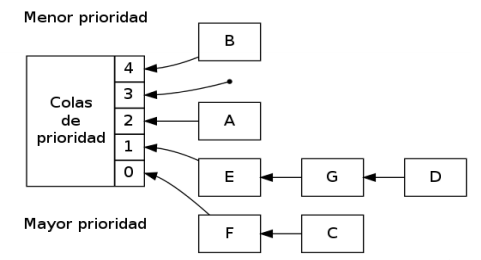

###### Ejemplo: _algoritmo de colas múltiples, todas las colas tienen asociado el algoritmo FIFO_

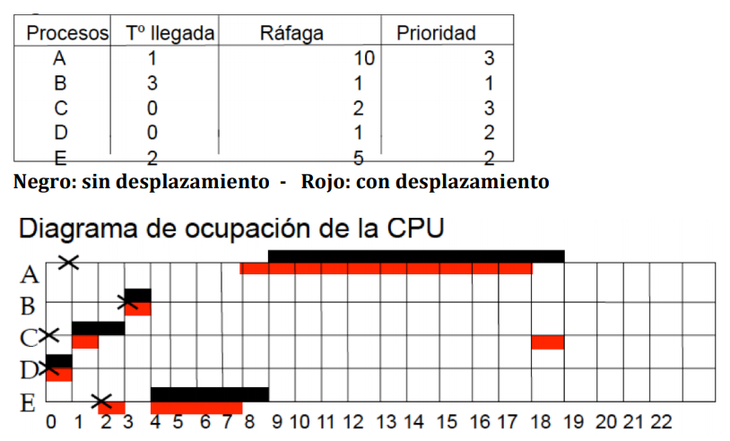

###### Ejemplo: _algoritmo de colas múltiples sin desplazamiento en el que todas las colas tienen asociado el algoritmo RR con distintos valores de quantum_

\> Cola _i_: ___q___ = _i_

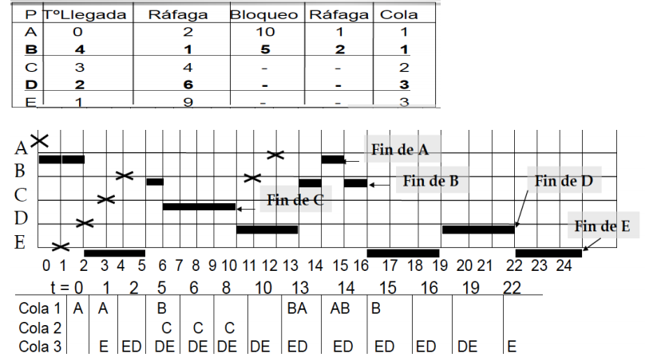

###### Ejemplo: _algoritmo de colas múltiples con desplazamiento en que todas las colas tienen asociado el algoritmo RR con distintos valores de quantum_

\> Cola _i_: ___q___ = _i_

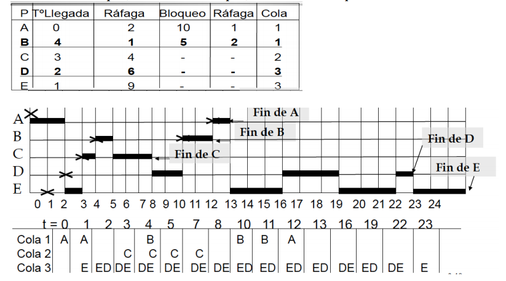

##### Problema de inanición

Cuando las prioridades son fijas puede surgir el problema de la **inanición**: un proceso puede estar esperando indefinidamente sin llegar a ejecutarse ocurrirá si van apareciendo siempre procesos ejecutables de mayor prioridad.

Posibilidades para evitar el problema de la inanición:

1. añadir un mecanismo de envejecimiento: el algoritmo aumenta la prioridad a un proceso cuando ha superado un determinado tiempo en espera sin ser ejecutado.
2. asegurar que cada cola disfruta de un determinado porcentaje de tiempo de CPU (que deberá repartir entre sus procesos) ejemplo con 2 colas:...

###### Ejemplo del caso (b) con 2 colas

* cola de mayor prioridad:
  * asociada a los procesos interactivos se rige por el algoritmo RR
  * deberá disfrutar del 80% del tiempo de CPU
* cola de menor prioridad:
  * asociada a trabajos batch se rige por el algoritmo FCFS
  * deberá disfrutar del 20% del tiempo de CPU

#### 1.5.6 Algoritmo de planificación de colas múltiples con realimentación o con traspaso

_Ver en Stallings_

### 1R. Reflexiones

##### 1) Explicación del hecho de que la penalización P tenga valores muy altos para ráfagas cortas en casi todos los algoritmos de asignación de CPU

Se define
$$
P = \frac{E + t}t
$$

siendo ___t___ el tiempo de CPU de la ráfaga.

Para ráfagas con ___t___ muy pequeño, es apreciable el tiempo empleado por el SO en cambio de contexto por tanto ___E___ es grande frente a ___t___ (el proceso espera un tiempo grande antes de que efectivamente comience a ejecutarse) y por tanto ___P___ toma un valor alto.

##### 2) Actuación del planificador a corto plazo cuando es invocado pero no hay ningún proceso en la cola de ejecutables

* El planificador a corto plazo evalúa si el número de procesos ejecutables es 0, y estaría en un bucle de espera ocupada chequeando reiteradamente dicha condición:

  `while (nº de procesos ejecutables == 0) {}; // nada`

  La llegada de un nuevo proceso ejecutable, siempre asociado a la producción de una interrupción, activará cierta parte del SO que incrementará el nº de procesos ejecutables e incluirá al recién llegado en la cola de ejecutables.

* En muchos sistemas operativos durante el arranque del sistema se crea un proceso “nulo” con estas características:

   - nunca termina
   - nunca se bloquea
   - tiene la prioridad más baja en el sistema

  Algunas de las tareas que se le pueden dar al proceso nulo, por ejemplo, es realizar estadísticas, chequeos sobre la integridad del sistema, etc.

  Debido que su prioridad es la más baja del sistema, este proceso nulo será invocado por el planificador a corto plazo cuando no haya ningún otro proceso existente.

* Ejecutar una instrucción máquina para dejar en reposo a la CPU. La llegada de un nuevo ejecutable hará pasar a la CPU a modo de funcionamiento normal y proseguiría la ejecución del planificador a corto plazo.

##### 3) Supongamos que tenemos un SO con una modalidad de planificación no apropiativa, explicar qué modificaciones tendríamos que realizar para implementar la modalidad apropiativa

Solo hay que añadir nuevos eventos que activen al planificador a corto plazo. Deberá activarse al menos ante la llegada de un nuevo ejecutable (por creación de un nuevo proceso o por cambio de estado de bloqueado a ejecutable). En cualquier caso, el SO debe chequear si es adecuado llamar al planificador a corto plazo al retornar de una interrupción, llamada al sistema o excepción.